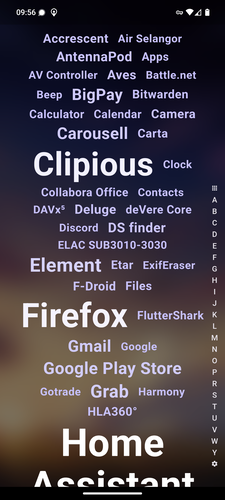
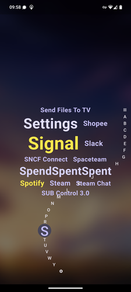
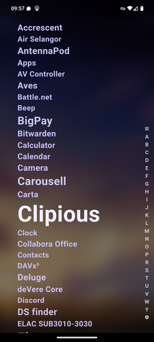
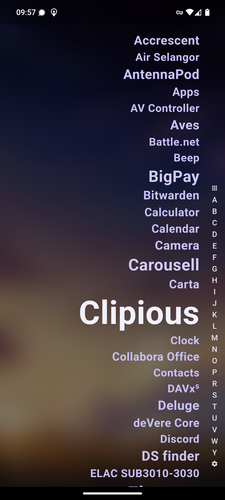

# Senang Launcher

A minimalist and efficient launcher.

Heavily inspired by [ap15 Launcher](https://play.google.com/store/apps/details?id=com.aurhe.ap15)
and [Niagara launcher](https://niagaralauncher.app/), Senang Launcher aims to be minimalist in the
way it looks and efficient. The more you use an app the bigger it becomes so you favourite apps are
easier to find and launch, also, any app on your phone is available within 2 taps via the letter
list slider.

## License

Copyright (C) 2024 Paul Fauchon

This program is free software: you can redistribute it and/or modify
it under the terms of the GNU Affero General Public License as published
by the Free Software Foundation, either version 3 of the License, or
(at your option) any later version.

This program is distributed in the hope that it will be useful,
but WITHOUT ANY WARRANTY; without even the implied warranty of
MERCHANTABILITY or FITNESS FOR A PARTICULAR PURPOSE. See the
GNU Affero General Public License for more details.

You should have received a copy of the GNU Affero General Public License
along with this program. If not, see <https://www.gnu.org/licenses/>.

## Screenshots

[](./fastlane/metadata/android/en-US/images/phoneScreenshots/1.png)
[](./fastlane/metadata/android/en-US/images/phoneScreenshots/2.png)
[](./fastlane/metadata/android/en-US/images/phoneScreenshots/3.png)
[](./fastlane/metadata/android/en-US/images/phoneScreenshots/4.png)

## Installation
The best way to install is to get it directly from the release page. Using [Obtainium](https://github.com/ImranR98/Obtainium) can help keeping the app up to date.

[//]: # (It is also available on F-Droid, IzzyOnDroid, and Accrescent:)

[//]: # ()
[//]: # ([]&#40;https://f-droid.org/packages/com.github.lamarios.clipious/&#41;)

[//]: # ([]&#40;https://apt.izzysoft.de/fdroid/index/apk/com.github.lamarios.clipious/&#41;)

[//]: # ([]&#40;https://accrescent.app/app/com.github.lamarios.clipious&#41;)

Or download the latest APK from the [Releases Section](https://github.com/lamarios/Senang-Launcher/releases/latest).

## Contribute

### Code

To get started, you'll need to create a fork of the repo and might run:

```
git submodule init
git submodule update
#enable git pre commit hooks for auto formatting
./submodules/flutter/bin/dart run tools/setup_git_hooks.dart
```

or using nix that will handle all the above. 

```
nix-shell
```

Flutter itself is used as a submodule of this repo in order to pin the version I want to use to
enable reproducible build on f-droid

You'll need to also set up your android SDK and a device / emulator to run the app on.
